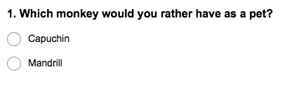

# SurveyMonkey API
## Overview
### Getting Started
SurveyMonkey APIはRESTベースで、OAuth 2.0を採用し、レスポンスをJSONで返します。

APIを使用するには、SurveyMonkeyアカウントにドラフトアプリを登録する必要があります。  
ドラフトアプリの開発には90日間の猶予があり、その後、公開または非公開で展開する必要があります。  
公開アプリは、SurveyMonkeyアカウントを持っている人なら誰でも利用でき、当社の[App Directory](https://www.surveymonkey.com/apps/)で公開されます。  
自分自身や組織のためにアプリを作成する場合は、プライベートアプリを配布することができます。

#### Public Apps
公開アプリは、SurveyMonkeyユーザーに機能を拡張します。すべてのアプリは、SurveyMonkeyによる審査と承認が必要であり、当社のアプリディレクトリで公開する前に当社の利用規約を遵守する必要があります。

公開アプリは、スコープを使用してOAuth中にアプリのユーザーに許可を要求します。スコープによっては、アプリのユーザーが有料のSurveyMonkeyプランを持っている必要があります。

[App Directory](https://www.surveymonkey.com/apps/)で公開されている公開アプリは、当社のAPIに無制限にリクエストできます。  
公開アプリがドラフト(開発中)の場合は、ドラフトリクエストの制限に従います。

#### Private Apps
プライベートアプリはSurveyMonkeyによるレビューを受ける必要はありません。プライベートアプリは当社の利用規約に従います。  
プライベートアプリにはAPIリクエストの上限があり、上限を超える場合は購入することができます。

プライベートアプリのすべてのユーザーは、同じSurveyMonkeyチームに所属し、APIに直接アクセスできる有料のSurveyMonkeyプランを利用している必要があります。

#### アプリの登録
SurveyMonkeyのアカウントを持っていれば、誰でもアプリを登録することができます。  
登録すると、90日間自分のアカウントに対してクエリを実行するために使用できるアクセストークンを持つ下書きアプリが作成されます。  
他のSurveyMonkeyアカウントではドラフトアプリを認証することはできません。  
90日間の期間が終了する前に、アプリを公開または非公開のいずれかにデプロイし、必要に応じてアカウントをアップグレードする必要があります。

#### アプリのデプロイ
90日間のドラフト期間が終了する前に、アプリをデプロイする必要があります。  
アプリが無効になった場合は、アプリをデプロイするかヘルプセンターに連絡して延長を申請してください。

### スコープ
スコープを使用すると、アプリがユーザーに代わって特定のリソースにアクセスできるようになります。  
たとえば、**Create/Modify survey**では、アプリがユーザーのアカウントにSurveyを作成することができます。  
OAuthプロセスでは、アプリがアクセスを要求しているスコープへのアクセス許可をユーザーに求めます。

スコープによっては、アプリのユーザーがSurveyMonkeyの有料プランに加入している必要があります。  
Publicアプリで有料プランに関連付けられたスコープを使用している場合、必要なプランを持たずに認証を行おうとするアカウントは、処理を続行するためにアップグレードするよう求められます。  
リクエストヘッダには、ユーザーのプランで利用可能なスコープと、ユーザーがあなたのアプリに許可を与えたスコープが含まれています。

アプリの設定で、スコープを必須、任意、または不要に設定できます。  
OAuthプロセスを成功させるためには、すべての必須スコープがユーザーによって承認され、利用可能でなければなりません。

**Create/Modify Responses**と**Create/Modify Surveys**の2つのスコープは、公開アプリで使用するにはSurveyMonkeyの承認が必要です。公開アプリをデプロイしていて、これらのスコープを含むようにスコープ要件を変更したい場合は、ヘルプセンターまでご連絡いただき、お客様のアプリとユースケースについて詳しく教えていただく必要があります。

**Create/Modify Collectors**では、Webリンクコレクター以外のコレクターを作成するには、有料のSurveyMonkeyプランが必要です。

|スコープラベル|説明|スコープ名|Paid?|
|--|--|--|:--:|
|View Surveys|自分のSurveyと共有Surveyを見る|surveys_read|無料|
|Create/Modify Surveys|アカウントでSurveyを作成/編集する|surveys_write|無料|
|View Collectors|自分のSurveyおよび共有されたSurveyのコレクターを表示する|collectors_read|無料|
|Create/Modify Collectors|アカウントでSurveyのコレクターを作成/編集する|collectors_write|有料 (weblink collectorsを除く)|
|View Contacts|ContactとContactリストを表示する|contacts_read|無料|
|Create/Modify Contacts|アカウントのContactを作成/編集する|contacts_write|無料|
|View Responses|アカウント内のSurveyに回答があるかどうか、およびそのメタデータを表示する|responses_read|無料|
|View Response Details|回答、回答数、傾向を表示する|responses_read_detail|有料|
|Create/Modify Responses|自分のアカウントでSurveyの回答を作成/編集する|responses_write|有料|
|View Webhooks|アカウントに変更があった場合に通知を受け取るためのWebhookを表示する|webhooks_read|無料|
|Create/Modify Webhooks|Webhookを作成/編集する<br>アカウントに変更があった際には通知を受け取ることができる|webhooks_write|無料|
|View Users|ユーザー情報を見る|users_read|無料|
|View Teams|所属チームを見る|groups_read|有料|
|View Library Assets|Surveyテーマとテンプレートのライブラリを見る|library_read|無料|
|View Workgroups|チーム内のワークグループを見る|workgroups_read|有料|
|Create/Modify Workgroups|チーム内のワークグループの作成/編集する|workgroups_write|有料|
|View Workgroup Members|ワークグループのメンバーを表示する|workgroups_members_read|有料|
|Create/Modify Workgroup Members|ワークグループのメンバーを追加/削除する|workgroups_members_write|有料|
|View Roles|チームのメンバーに割り当て可能な役割を表示する|roles_read|有料|
|Create/Modify Roles|チームの役割の作成/編集する|roles_write|有料|
|View Workgroups Shared Resources|ワークグループ内で共有されているリソースを表示する|workgroups_shares_read|有料|
|Create/Modify Workgroups Shared Resources|ワークグループ内で共有されているリソースの追加/削除する|workgroups_shares_write|有料|

### リクエストとレスポンスの制限
ドラフトおよびプライベート・アプリはレート制限の対象となります

- 1分間の最大リクエスト数: **120**  
- 1日の最大リクエスト数: **500**

APIの上限は、グリニッジ標準時(GMT)の毎日午前12時にリセットされます。  
30日以内に150%までの違反が3回まで許可されます。  
それを超えると、100%で制限を開始します。

アプリのレート制限、残りのリクエスト数、リセットまでの秒数をリクエストヘッダで返します。

さらに、Contactの作成やInvite Messageの送信のためにAPIに行われたリクエストは、送信およびContactの制限の対象となります。

##### 制限の増加
すべてのドラフトアプリとプライベートアプリは、当初120コール/分、500コール/日のリクエスト制限が適用されます。  
制限のしきい値を超える恐れがあり、一時的な増額が必要な場合は、ヘルプセンターにご連絡ください。  
SurveyMonkeyは5営業日以内にすべてのリクエストを確認します。  
料金の上限を引き上げるには追加料金がかかる場合があります。

##### 回答数制限
当社では、データベースの利用を公正に行うために、グローバルな回答制限も設けています。

##### プロパティの制限
特に指定のない限り、最大ページサイズは1000件です。
Surveyの最大サイズ1000質問、制限を超えたSurveyは413を返します。

### 認証
プライベートアプリを作成し、自分のSurveyMonkeyアカウントにのみアクセスする場合は、アプリの登録時に生成されたアクセストークンをアプリの設定の一部として使用できます。このトークンは`MY APPS`タブの`Settings`で取得します。

アプリが複数のSurveyMonkeyアカウントにアクセスする場合は、以下に説明するOAuth 2.0の3ステップフローを実装して、ユーザーがアプリでアカウントにアクセスすることを承認できるようにします。  
このフローでは、アプリが関連するSurveyMonkeyアカウントへのAPI呼び出しのたびに使用できる、長期間のアクセストークンを生成します。  
アクセストークンは、APIクレデンシャル(クライアントID)と組み合わせて使用した場合にのみアクセスを許可し、認証されたSurveyMonkeyアカウントのみにアクセスを許可することに注意してください。  
アプリはアクセスしたいSurveyMonkeyアカウントごとに追加のアクセストークンを取得する必要があります。

アプリに必須のスコープがある場合、ユーザーはすべてのスコープを承認する必要があり、アプリへのOAuthを成功させるには有料のSurveyMonkeyプランが必要になる場合があります。

#### OAuth 2.0 ワークフロー
##### Step1: ユーザーをSurveyMonkeyのOAuth認証ページに誘導する
アプリは、アクセスしたいSurveyMonkeyアカウントを持つユーザーに、`https://api.surveymonkey.com`で特別に作成したOAuthリンクを送信します。  
ユーザーに表示されるページでは、アプリを識別し、まだログインしていない場合はSurveyMonkeyにログインするよう求め、必要なスコープを承認するよう求めます。

OAuthリンクは、URLエンコードされたパラメータ(`redirect_uri`、`client_id`、`response_type`、`state`)を`https://api.surveymonkey.com/oauth/authorize`に設定する必要があります。

- `response_type`は常に`code`に設定されます。  
- `client_id`はアプリの登録時に取得した固有のSurveyMonkeyクライアントIDです。  
- `redirect_uri`はアプリに登録したOAuthリダイレクトURIをURLエンコードしたものです。([ここ](https://developer.surveymonkey.com/apps/)で見つけて編集できます)  
- `state`(推奨)リクエストに含まれる値で、トークンのレスポンスでも返されます。任意の内容の文字列を指定できます。クロスサイトリクエストフォージェリ攻撃を防ぐために、ランダムに生成されるユニークな値が一般的に使用されます。

##### Step2: ユーザーの承認によるShort-livedコードの生成
ユーザーがアクセスを承認するかどうかを選択すると、SurveyMonkeyはブラウザをリダイレクトURIに送信する302リダイレクトを生成します。  
あなたのアプリはそのコードを使って、期限切れ(5分)になる前に別のAPIリクエストを行う必要があります。  
そのリクエストで、受け取ったコードとクライアントシークレット、クライアントID、リダイレクトURIをお送りください。  
私たちはその情報をすべて確認します。  
問題がなければ、トークンを返します。

##### Step3: 長期間のアクセストークンと交換する
以下のエンコードされたフォームフィールドを持つ、`https://api.surveymonkey.com/oauth/token`へのフォームエンコードされたHTTP POSTリクエストを作成します:  
- `client_id`
- `client_secret`
- `code`
- `redirect_uri`
- `grant_type`
`grant_type`は`authorization_code`に設定する。`client_secret`は[ここ](https://developer.surveymonkey.com/apps/)にあります。

成功すると、アクセストークンがPOSTリクエストのレスポンスボディにJSONとしてエンコードされて返されます。キーは`access_token`で、その値はHTTPヘッダーとして`Authorization: bearer YOUR_ACCESS_TOKEN`の形式でAPIに渡すことができます。ヘッダーの値は、**bearer**の後に半角スペース、そしてあなたのアクセストークンの順でなければなりません。

##### トークンの有効期限と失効
私たちのアクセストークンは将来失効する可能性があります。変更を加える前に、すべての開発者に警告します。

アクセストークンはユーザが失効させることがあります。  
この場合、APIリクエストの際に、`1`という値の`status`パラメータと、`Client revoked access grant`という値の`errmsg`パラメータを含むJSONエンコードされたレスポンスボディが返されます。このレスポンスを受け取った場合は、再度OAuthを完了させる必要があります。

##### アクセスURL
SurveyMonkeyアカウントのデータセンターによっては、APIアクセスURLが`https://api.surveymonkey.com`と異なる場合があります。  
EUのデータセンターのAPIは`https://api.eu.surveymonkey.com`で、カナダのデータセンターのAPIは`https://api.surveymonkey.ca`です。  
各SurveyMonkeyアカウントの正しいAPIアクセスURLは、トークン交換のコードのレスポンス本文で`access_url`の値として返されます。

##### アプリの認証解除
アプリの承認を取り消すには:
1. リンク先のSurveyMonkeyアカウントにログインします。
1. 右上のユーザー名のドロップダウンから`My Account`を選択します。
1. `Linked Account`までスクロールし、認証を解除するアプリの横にある`Remove`をクリックします。

### クイックスタートガイド(2つの共通ユースケース)
##### Surveyの結果のエクスポート
`surveys/{id}/responses/bulk`への呼び出しは選択されたすべての回答のIDを含む回答を返しますが、このユースケースではこれを選択された値と関連付けることが考えられます。次の例では、Surveyの結果をエクスポートし、回答を対応する回答値と関連付ける方法を説明します。

SurveyMonkeyアカウントの最初の1,000件のSurveyを`GET /surveys`で取得します。この呼び出しは、SurveyIDを含むリストリソースを返します。  
前のコールで取得したSurveyIDを使用して、`/surveys/{id}/details`をGETします。この呼び出しは、すべての質問IDと回答の選択肢ID、およびそれらに関連付けられた値を含むSurveyのデザインを返します。  
これらの値をキャッシュすることで、リクエストとレスポンスの上限を節約します。

同じSurveyIDを使用して、`/surveys/{id}/responses/bulk?per_page=100`へのGETでSurveyの最初の100件の回答を取得します。このエンドポイントは、各回答の質問IDと選択された回答または選択肢のIDを返します。  
これらを使用して、選択された回答IDを`/surveys/{id}/details`へのGETから返されたものに関連付け、質問の値を選択された回答に一致させることができます。  
`links.next`フィールドに返されたリソースURLを使用して、100件の回答の次のページを取得します。  
アカウント内のすべてのSurveyの結果をエクスポートするには、Step1で返されたすべてのSurveyIDを繰り返し、Step2~4を完了します。

単一のコレクターの結果をエクスポートするには、`/surveys/{id}/collectors`へのGETは、指定したSurveyに関連付けられたコレクターのIDリストを返します。`surveys/{id}/details`へのGETは、単一のコレクターからの回答を返します。

##### Invitation Messageの送信
次の例では、Invitationメールコレクターの作成と受信者リストへの送信について説明します。

SurveyMonkeyアカウントの最初の1,000件のSurveyを`GET /surveys`で取得します。この呼び出しは、SurveyIDを含むリストリソースを返します。
前のコールで取得したSurveyIDを使用して、`/surveys/{id}/collectors`にPOSTしてメールタイプのコレクターを作成します。
コレクター`/{id}/messages`にPOSTして、メールメッセージを作成し、フォーマットします。
`collectors/{id}/messages/{id}/recipients/bulk`にPOSTして、メッセージを受信する受信者をアップロードします。
`collectors/{id}/messages/{id}/send`へのPOSTでメッセージを送信します。

### ページネーション
リストリソースをリクエストするときは、`per_page=#`でページのサイズを設定し、`page=#`でどのページを返すかを指定します。つまり、`https://api.surveymonkey.com/v3/surveys?page=2&per_page=5`へのリクエストは、5つのSurveyの2ページ目を返します。

リストリソースへのどのリクエストも、利用可能な場合は以下のページ分割フィールドを返します

|Name|Description|Type|
|-|-|-|
|per_page|ページあたりのリソース数|Integer|
|total|リソースの総数|Integer|
|page|どのページが返されるかを示す|Integer|
|links.self|現在のページのURL|String|
|links.prev|前のページのURL|String|
|links.next|次のページのURL|String|
|links.first|最初のページのURL|String|
|links.last|最終ページのURL|String|

### ヘッダー
APIは以下のカスタムヘッダーを返します

|Header|Description|
|-|-|
|X-OAuth-Scopes-Available|アプリを使用するユーザーが利用可能なスコープ|
|X-OAuth-Scopes-Granted|ユーザーがアプリにどのスコープを許可したか|
|X-Ratelimit-App-Global-Day-Limit|アプリが持つ1日あたりのリクエスト制限|
|X-Ratelimit-App-Global-Day-Remaining|アプリが1日の制限に達するまでの残りリクエスト数|
|X-Ratelimit-App-Global-Day-Reset|残りレート制限がリセットされるまでの秒数|
|X-Ratelimit-App-Global-Minute-Limit|アプリが持つ1分あたりのリクエスト制限|
|X-Ratelimit-App-Global-Minute-Remaining|アプリが1分あたりの制限に達するまでの残りリクエスト数|
|X-Ratelimit-App-Global-Minute-Reset|残りレート制限がリセットされるまでの秒数|

### データ型
APIは以下のデータ型を返します

|Data Type|Description|
|-|-|
|Integer|最大値 2147483647 の整数。特に指定がない限り、負の値は許されない。|
|String|文字列。|
|String-ENUM|定義済みの文字列値。値はフィールドごとに定義されています。|
|Boolean|真偽値。JSONでは、ネイティブのboolean型で表現されます。|
|Date string|日付は通常YYYY-MM-DDTHH:MM:SS+HH:MMの形式です。これからの逸脱はドキュメントに示されています。すべての日付文字列は暗黙的にUTCになります。|
|Phone number string|電話番号は+1XXXYYYZZZZの形式でなければなりません。|
|Hex string|HHHHまたは#HHHHHH(Hは16進数)の形式でなければならない。|
|Array|単純な値のリスト。JSONでは配列になります。|
|Object|名前と値のペアのコレクション。JSONではオブジェクトになる。|
|Null|ヌル値。JSONでは、これはネイティブのnull型として表現されます。|

### エラーコード
|Error Code|HTTP Status Code|Message|
|-|-|-|
|1000|400 Bad Request|指定された入力ではリクエストを処理できません。|
|1001|400 Bad Request|提供されたボディが適切なJSON文字列ではありません。|
|1002|400 Bad Request|指定されたボディ内のスキーマが無効です。|
|1003|400 Bad Request|無効な URL パラメータです。|
|1004|400 Bad Request|無効なリクエストヘッダです。|
|1005|402 Payment Required|この機能を利用するには、アカウントをアップグレードする必要があります。|
|1010|401 Authorization Error|認証トークンが提供されていません。|
|1011|401 Authorization Error|提供された認証トークンが無効です。|
|1012|401 Authorization Error|提供された認証トークンは期限切れです。|
|1013|401 Authorization Error|クライアントが提供された認証トークンへのアクセスを取り消しました。|
|1014|403 Permission Error|このリクエストはユーザーによって許可されていません。|
|1015|403 Permission Error|ユーザーは、このリクエストを行うために必要なプランを持っていません。|
|1016|403 Permission Error|ユーザーはリソースにアクセスする権限を持っていません。|
|1017|403 Permission Error|ユーザーがこのリソースのクォータ制限に達しました。|
|1018|403 Permission Error|このユーザーは、この地域のホストにアクセスする権限を持っていません。<br>アクセスURLを確認してください。|
|1020|404 Resource Not Found|要求されたリソースの取得にエラーが発生しました。|
|1025|409 Resource Conflict|競合のためリクエストを完了できません。リソースの設定を確認してください。|
|1026|409 Resource Conflict|要求されたリソースはすでに存在しています。|
|1030|413 Request Entity Too Large|要求されたエンティティが大きすぎるため、返せません。|
|1040|429 Rate Limit Reached|リクエストが多すぎます。|
|1050|500 Internal Server Error|そんなバナナ！リクエストを処理できませんでした。|
|1051|503 Internal Server Error|サービスにアクセスできません。後でもう一度お試しください。|
|1052|404 User Soft Deleted|あなたがこのリクエストを行っているユーザーは、論理削除されています。|
|1053|410 User Deleted|あなたがこのリクエストを行っているユーザーは物理削除されました。|
|1054|502 Bad Gateway Error|ネットワークがサーバーに接続できませんでした。|
|1055|504 Gateway Timeout|サービス接続がタイムアウトしました。後でもう一度お試しください。|
|1056|400 Bad Request|このメッセージの受信者が多すぎます。|
|1057|401 Authorization Error|認証トークンには権限がありません。|
|1058|403 Permission Error|このリクエストを実行する前に、ユーザーのEメールを確認する必要があります。|
|1059|400 Bad Request|メッセージを送信しようとしたが、受信者が指定されていません。|
|1060|400 Bad Request|埋め込みボディが保存されていません。|
|1061|405 Method Not Allowed|指定されたHTTPメソッドは許可されていません。|
|1062|400 Bad Request|このリソースに対するリクエストの上限を超えました。|
|1063|401 Bad Unauthorized|ユーザーはこのアクションを実行する権限がありません。<br>リクエストの詳細を確認し、もう一度やり直してください。|

### ヘルプとリソース
SurveyMonkeyは[Github](https://github.com/SurveyMonkey)でコード例を公開しています。  
SDKやサンプルを追加したい場合は、お知らせください。また、[ヘルプセンター](https://help.surveymonkey.com/contact/)によるサポートも提供しています。

## APIエンドポイント
Base URLs: `https://api.surveymonkey.com/v3`

### ユーザーとチーム
これらのエンドポイントを使用して、ユーザのアカウント情報、ユーザが所属しているチーム、チームのオーナーのアカウント情報、その他のメンバーの役割やチームへの招待を承認したかどうか(アクティブかどうか)などを取得します。

> 当社のAPIではグループという用語を使用していますが、SurveyMonkeyのUIではチームを使用しています。この2つの用語は同じ概念を指しています。チームについての詳細はヘルプセンターをご覧ください。

#### GET /users/me
`GET /users/me`

##### 利用可能なメソッド
- `HEAD`: リソースが利用可能かをチェックする
- `OPTIONS`: 利用可能なメソッドとオプションを返す
- `GET`: 現在のユーザーのアカウント詳細(プランも含む)を返す。公開アプリのユーザーは、**View Users**スコープのパラメータにアクセスする必要があります

##### Responseスキーマ
Status Code: 200

|Name|Type|Description|
|-|-|-|
|id|string|User Id|
|username|string|Username|
|first_name|string|User’s first name|
|last_name|string|User’s last name|
|language|string|ISO 639-1コード(ユーザーアカウントの言語設定用)|
|email|string|ユーザーアカウントのメールアドレス|
|email_verified|boolean|ユーザーアカウントのメールアドレスが承認されているかどうかのブール値|
|account_type|string|ユーザーのSurveyMonkeyのプラン|
|date_created|string|ユーザーアカウントが作成された日付|
|date_last_login|string|ユーザーの最終ログイン日|
|question_types|object|ユーザーが利用可能な質問タイプのブール値|
|scopes|object|ユーザーが利用可能なスコープ、および付与されたスコープを含む|
|granted|[string]|OAuth時にユーザが承認したスコープをリストアップする|
|available|[string]|ユーザーが利用可能なスコープを一覧表示|
|sso_connections|[string]|サードパーティとのコネクション|
|features|object|ユーザーが利用できる機能。これらは文字列またはブーリアン値で識別される|
|href|string|このエンドポイントに関連するリンク|

```json
{
  "id": "1",
  "username": "username",
  "first_name": "firstName",
  "last_name": "lastName",
  "language": "en",
  "email": "firstnamelastname@surveymonkey.com",
  "email_verified": false,
  "account_type": "enterprise",
  "date_created": "2021-05-27T16:29:00+00:00",
  "date_last_login": "2021-06-21T13:57:15.657000+00:00",
  "question_types": {
    "comment_box_question_type": true,
    "file_upload_question_type": true,
    "matrix_question_type": true,
    "ranking_question_type": true,
    "rating_question_type": false,
    "slider_question_type": true,
    "star_rating_question_type": true,
    "textbox_multiple_question_type": true,
    "video_question_type": false
  },
  "scopes": {
    "granted": [
      "surveys_write",
      "surveys_read"
    ],
    "available": [
      "users_read",
      "surveys_read",
      "collectors_read",
      "collectors_write",
      "contacts_read",
      "contacts_write",
      "surveys_write",
      "responses_read",
      "responses_read_detail",
      "responses_write",
      "groups_read",
      "groups_write",
      "webhooks_read",
      "webhooks_write",
      "library_read",
      "workgroups_read",
      "workgroups_write",
      "workgroups_members_read",
      "workgroups_members_write",
      "roles_read",
      "roles_write",
      "workgroups_shares_read",
      "workgroups_shares_write"
    ]
  },
  "sso_connections": [
    "enterprise_saml"
  ],
  "features": {
    "collector_create_limit": "unlimited",
    "collector_email_enabled": true,
    "collector_thank_you_enabled": true,
    "create_question_limit": "unlimited",
    "num_free_responses": "unlimited"
  },
  "href": "https://api.surveymonkey.com/v3/users/me"
}
```

#### GET /users/{user_id}/workgroups
`GET /users/{user_id}/workgroups`

##### 利用可能なメソッド
- `HEAD`: リソースが利用可能かをチェックする
- `OPTIONS`: 利用可能なメソッドとオプションを返す
- `GET`: 特定のユーザーが属するグループを返す。公開アプリのユーザーは、**View Workgroups**スコープにアクセスする必要があります

##### GETのオプションクエリ
|Name|Type|Required|Description|
|-|-|-|-|
|per_page|string|false|ページごとに返すリソースの数。デフォルトは50|
|page|string|false|リソースのどのページを返すか。デフォルトは1|

##### Responseスキーマ
Status Code: 200

|Name|Type|Description|
|-|-|-|
|data|[object]|ワークグループに関連する情報|
|id|string|ユーザーID|
|name|string|ワークグループ名|
|description|string|ワークグループの説明|
|is_visible|boolean|ワークグループを一般に公開するか、メンバーと管理者のみに公開するかのブール値|
|metadata|object|ワークグループに関連する追加データ|
|created_at|string|ワークグループが作成された日時|
|updated_at|string|ワークグループが最後に更新された日時|
|members|[object]|ワークグループのアクティブメンバー|
|user_id|string|正会員のユーザーID|
|is_owner|boolean|アクティブメンバーはワークグループのオーナーであるというブール値|
|membership|object|要求されたユーザーの会員情報|
|is_owner|boolean|ユーザーはワークグループのオーナーかどうかのブール値|
|status|string|ユーザーのステータス。[`active`,`pending`]のいずれか|
|shares_count|integer|ワークグループと共有するリソースの数|
|members_count|integer|ワークグループのメンバー数(non-activeを含む)|
|default_role|object|ワークグループのデフォルトロール|
|id|string|ワークグループのID|
|name|string|デフォルトロールのタイプ。[`Analyzer`,`Collector`,`Full Access`,`Viewer`,`Editor`]のいずれか|
|description|string|デフォルトロールに関する追加情報|
|is_enabled|boolean|デフォルトロールはenabled|
|metadata|object|デフォルトロールの追加メタデータ|
|organization_id|string|このワークグループが所属する組織のID|
|per_page|integer|ページごとに返されるリソースの数|
|page|integer|返されたリソースのページ|
|total|integer|返されたワークグループの数|
|links|object|このエンドポイントのリンクを含む|
|self|string|このエンドポイントに関連するリンク|

```json
{
  "data": [
    {
      "id": "1",
      "name": "name",
      "description": "some description",
      "is_visible": true,
      "metadata": {},
      "created_at": "2019-05-22T17:38:58",
      "updated_at": "2020-07-29T20:32:33",
      "members": [
        {
          "user_id": "2",
          "is_owner": true
        },
        {
          "user_id": "1",
          "is_owner": false
        }
      ],
      "membership": {
        "status": "active",
        "is_owner": true
      },
      "shares_count": 3,
      "members_count": 2,
      "default_role": {
        "id": "2",
        "name": "Viewer",
        "description": "",
        "is_enabled": true,
        "metadata": {}
      },
      "organization_id": "1"
    }
  ],
  "per_page": 50,
  "page": 1,
  "total": 1,
  "links": {
    "self": "https://api.surveymonkey.com/v3/users/2/workgroups?page=1&per_page=50"
  }
}
```

#### GET /users/{user_id}/shared
`GET /users/{user_id}/shared`

##### 利用可能なメソッド
- `HEAD`: リソースが利用可能かをチェックする
- `OPTIONS`: 利用可能なメソッドとオプションを返す
- `GET`: 全てのワークグループでユーザーと共有されているリソースを返す。公開アプリのユーザーは、**View Workgroup Shares**スコープにアクセスする必要があります

##### GETのオプションクエリ
|Name|Type|Required|Description|
|-|-|-|-|
|per_page|string|false|ページごとに返すリソースの数。デフォルトは50|
|page|string|false|リソースのどのページを返すか。デフォルトは1|
|resource_type|string|false|共有リソースのタイプ|
|resource_id|string|false|共有リソースのカンマ区切りID (resource_typeと併用する必要がある)|
|include|string|false|各リソースについて返す追加フィールドを指定する。`permissions`, `resource_details`のいずれか。`permissions`は各ワークグループのコレクターと調査アクションの権限を示し、`resource_details`は各共有リソースの詳細情報を示す。|

##### Responseスキーマ
Status Code: 200

|Name|Type|Description|
|-|-|-|
|data|[object]|共有リソースとその情報を含む|
|share_id|string|シェアレコードのID|
|workgroup_id|string|共有されたワークグループのID|
|resource_type|string|共有リソースのタイプ(調査など)|
|resource_id|string|共有リソースのID(SurveyIDなど)|
|privileges|[string]|この共有レコードによってユーザーに付与されたスコープ付き特権の配列|
|per_page|integer|ページごとに返されるリソースの数|
|page|integer|返されたリソースのページ|
|total|integer|返却された共有リソースの数|
|links|object|このエンドポイントのリンクを含む|
|self|string|このエンドポイントに関連付けられたリンク|

```json
{
  "data": [
    {
      "share_id": "0ca749c2893245c5b96a128eee4c2d42",
      "workgroup_id": "71d9d408d1914c9ca85ffcda8330d675",
      "resource_type": "survey",
      "resource_id": "101101101",
      "privileges": [
        "design.read_only",
        "collect.read_only",
        "analyze.read_only"
      ]
    }
  ],
  "per_page": 50,
  "page": 1,
  "total": 1,
  "links": {
    "self": "https://api.surveymonkey.com/v3/users/61003234/shared?page=1&per_page=50"
  }
}
```

#### GET /groups
`GET /groups`

##### 利用可能なメソッド
- `HEAD`: リソースが利用可能かをチェックする
- `OPTIONS`: 利用可能なメソッドとオプションを返す
- `GET`: ユーザアカウントがチームに所属している場合、チームを返す (ユーザは1つのチームにしか所属できない)。公開アプリのユーザーは、**View Teams**スコープにアクセスする必要があります

##### GETのオプションクエリ
|Name|Type|Required|Description|
|-|-|-|-|
|per_page|string|false|ページごとに返すリソースの数|
|page|string|false|リソースのどのページを返すか。デフォルトは1|

##### Responseスキーマ
Status Code: 200

|Name|Type|Description|
|-|-|-|
|per_page|integer||
|total|integer||
|data|[object]||
|name|string|グループ名|
|id|string|グループID|
|href|string|リソースAPIのURL|
|links|object||
|self|string||
|page|integer||

```json
{
  "data": [
    {
      "id": "1",
      "name": "group name",
      "href": "https://api.surveymonkey.com/v3/groups/1"
    }
  ],
  "per_page": 50,
  "page": 1,
  "total": 1,
  "links": {
    "self": "https://api.surveymonkey.com/v3/groups?page=1&per_page=50"
  }
}
```

#### GET /groups/{id}
`GET /groups/{id}`

##### 利用可能なメソッド
- `HEAD`: リソースが利用可能かをチェックする
- `OPTIONS`: 利用可能なメソッドとオプションを返す
- `GET`: チームのオーナーやメールアドレスなど、チームの詳細を返す。公開アプリのユーザーは、**View Teams**スコープにアクセスする必要があります

##### Responseスキーマ
Status Code: 200

|Name|Type|Description|
|-|-|-|
|max_invites|integer|グループに入れるメンバーの最大数|
|date_created|string|グループが作成された日時|
|name|string|グループ名|
|id|string|グループID|
|href|string||
|member_count|integer|グループのメンバー数|

```json
{
  "id": "1",
  "name": "group name",
  "member_count": 5,
  "max_invites": 0,
  "date_created": "2018-08-08T21:58:32+00:00",
  "href": "https://api.surveymonkey.com/v3/groups/1"
}
```

#### GET /groups/{id}/activities
`GET /groups/{id}/activities`

##### 利用可能なメソッド
- `GET`: 指定されたグループのActivity関連データのリストを返す。公開アプリのユーザーは、adminである必要があります

##### GETのオプションクエリ
|Name|Type|Required|Description|
|-|-|-|-|
|limit|integer|false|返される行の最大数。デフォルトは50|
|offset|integer|false|結果のオフセット、つまりスキップする行数|
|start_date|Date|false|Activity関連データクエリの開始日|
|end_date|Date|false|Activity関連データクエリの終了日|

##### Responseスキーマ
Status Code: 200

|Name|Type|Description|
|-|-|-|
|sl_translate|string||
|total|integer||
|offset|integer||
|limit|integer||
|results|[object]||
|member_type|string|Activityのメンバータイプ|
|country|string||
|user_id|integer|Activityに記録されたユーザーID|
|group_id|integer|Activityに記録されたグループID|
|city|string||
|date_created|Date|Activityの作成日|
|user_name|string|Activityに記録されたユーザー名|
|activity_type|string|Activityの種類|
|division_name|any||
|activity_msg|string|Activityへのメッセージ|
|ip_address|string|ActivityのIPアドレスのログ|
|email|string|Activityに記録されたメールアドレス|

```json
{
  "sl_translate": "activity_msg,member_type",
  "total": 1,
  "offset": 0,
  "limit": 1,
  "results": [
    {
      "date_created": "2021-07-16 16:07:14",
      "user_id": 1,
      "user_name": "username",
      "email": "email@surveymonkey.com",
      "member_type": "<span>(Primary Admin)</span>",
      "group_id": 1,
      "activity_type": "survey_info_delete",
      "activity_msg": "<span>Deleted survey <span class=\"notranslate\"><b>put req name change</b></span></span>",
      "ip_address": "11.11.11.111",
      "city": "Theed",
      "country": "Naboo",
      "division_name": null
    }
  ]
}
```

#### GET /groups/{id}/activities/{activity_type}
`GET /groups/{id}/activities/{activity_type}`

##### 利用可能なメソッド
- `GET`: Activity列挙型の値が指定された場合、指定されたグループのインターバルごとの特定のActivityのカウントを返す。公開アプリのユーザーは、adminである必要があります

##### ActivityタイプのEnum
- authentication_succeeded
- authentication_failed
- authentication_signout
- group_info_updated_group_name
- invite_created
- invite_resent
- member_deleted
- member_joined
- survey_info_create
- survey_info_delete
- survey_info_copy
- survey_info_update
- survey_info_transfer
- collector_info_created
- collector_info_deleted
- collector_info_updated
- member_updated_group_member_type
- permission_created
- permission_updated
- shared_view_created
- shared_view_updated
- export_export_create
- export_downloaded
- respondent_updated
- respondent_deleted
- grant_info_created
- grant_info_deleted

##### GETのオプションクエリ
|Name|Type|Required|Description|
|-|-|-|-|
|interval|string-ENUM|true|一連のデータを返すインターバル("daily","weekly","monthly","yearly"のいずれか)|
|start_date|Date|false|アクティビティ関連データクエリの開始日|
|end_date|Date|false|アクティビティ関連データクエリの終了日|

##### Responseスキーマ
Status Code: 200

|Name|Type|Description|
|-|-|-|
|series|array|指定したActivityタイプのインターバルごとのカウントの一連のデータ|
|times|array|一連のデータセットのタイムラベル|
|interval|string|返された一連のデータのインターバル|

```json
{
  "series": [
    86,
    193
  ],
  "times": [
    "2020",
    "2019"
  ],
  "interval": "yearly"
}
```

#### GET /groups/{group_id}/members
`GET /groups/{group_id}/members`

##### 利用可能なメソッド
- `HEAD`: リソースが利用可能かをチェックする
- `OPTIONS`: 利用可能なメソッドとオプションを返す
- `GET`: 指定したグループのメンバーとして追加されたユーザーのリストを返す。公開アプリのユーザーは、**View Teams**スコープにアクセスする必要があります

##### GETのオプションクエリ
|Name|Type|Required|Description|
|-|-|-|-|
|per_page|integer|false|ページごとに返すリソースの数。デフォルトは50|
|page|integer|false|リソースのどのページを返すか。デフォルトは1|
|division_ids|string|false|メンバーIDのオプションリスト|
|include|string|false|プロパティを含めるかどうか オプションは[`first_name`, `last_name`, `user_id`, `email`, `type`, `language`, `status`]|

##### 詳細説明
**include**: プロパティを含めるかどうか。オプションは first_name、last_name、user_id、email、type、language、status

##### Responseスキーマ
Status Code: 200

|Name|Type|Description|
|-|-|-|
|per_page|integer||
|total|integer||
|data|[object]||
|id|string|メンバーId|
|href|string|リソースAPIのURL|
|username|string|メンバーのユーザー名|
|links|object||
|self|string||
|page|integer||

```json
{
  "data": [
    {
      "id": "1",
      "username": "user1",
      "href": "https://api.surveymonkey.com/v3/groups/1/members/1"
    },
    {
      "id": "2",
      "username": "user2",
      "href": "https://api.surveymonkey.com/v3/groups/1/members/2"
    }
  ],
  "per_page": 50,
  "page": 1,
  "total": 2,
  "links": {
    "self": "https://api.surveymonkey.com/v3/groups/1/members?page=1&per_page=50"
  }
}
```

#### GET /groups/{group_id}/members/{member_id}
`GET /groups/{group_id}/members/{member_id}`

##### 利用可能なメソッド
- `HEAD`: リソースが利用可能かをチェックする
- `OPTIONS`: 利用可能なメソッドとオプションを返す
- `GET`: グループメンバーの`role`や`status`などの詳細を返す。公開アプリのユーザーは、**View Teams**スコープにアクセスする必要があります

##### Responseスキーマ
Status Code: 200

|Name|Type|Description|
|-|-|-|
|user_id|string|グループメンバーのユーザーID|
|date_created|string|メンバーが作成された日時|
|last_name|string||
|language|string||
|id|string|メンバーId|
|href|string||
|type|string|メンバーのロールの種類: `regular`, `account_owner`, `admin`|
|first_name|string||
|email|string|ユーザーのメールアドレス|
|username|string|メンバーのユーザー名|
|status|string|メンバーのステータス(グループへの招待が承認されたかどうか): `active`, `pending`|

```json
{
  "id": "1",
  "username": "username",
  "email": "username@surveymonkey.com",
  "type": "regular",
  "status": "active",
  "user_id": "1",
  "language": "en",
  "first_name": "firstname",
  "last_name": "lastname",
  "date_created": "2021-06-24T18:27:33+00:00",
  "href": "https://api.surveymonkey.com/v3/groups/1/members/1"
}
```

#### PATCH /groups/{group_id}/members/{member_id}
`PATCH /groups/{group_id}/members/{member_id}`

    `PATCH`: グループメンバーのメールアドレスを更新

### Surveyページと質問
フォルダはSurveyを整理するために使用されます。  
以下のエンドポイントを使用すると、フォルダを取得および作成できます。  
`folder_id`を含む**/surveys**へのPOST、PUT、またはPATCHを使用して、Surveyを特定のフォルダに追加することができます。  
GET **/surveys**のクエリパラメータとして`folder_id`を使用することにより、Surveyをフォルダでフィルタすることもできます。

#### GET /surveys
`GET /surveys`

##### 利用可能なメソッド
- `HEAD`: リソースが利用可能かをチェックする
- `OPTIONS`: 利用可能なメソッドとオプションを返す
- `GET`: 認証されたユーザーが所有または共有しているSurveyのリストを返す。公開アプリのユーザーは、**View Surveys**スコープにアクセスする必要があります
- `POST`: 新しい空のSurveyを作成するか、テンプレートID または既存のSurveyID が指定されている場合は、ページと質問があらかじめ入力されたSurveyを作成する。公開アプリのユーザーは、**Create/Modify Surveys**スコープにアクセスする必要があります

##### GETのオプションクエリ
|Name|Type|Required|Description|
|-|-|-|-|
|page|string|false|リソースのどのページを返すか。デフォルトは1|
|per_page|string|false|ページごとに返すリソースの数|
|sort_by|string-Enum|false|返されたSurveyのソートに使用するフィールド: `title`, `date_modified`, or `num_responses`|
|sort_order|string-Enum|false|ソート順`ASC`または`DESC`|
|include|comma seperated string-Enum|false|Surveyのリストをフィルタリングするために使用する: `share_with`, `share_by`または`owner` (チームで使用する場合に便利)またはSurveyごとに返す追加のフィールドを指定するために使用する: `response_count`, `date_created`, `date_modified`, `language`, `question_count`, `analyze_url`, `preview`, `collect_stats`|
|title|string|false|タイトルでSurveyを検索|
|start_modified_at|string|false|Surveyの最終更新日は、この日付以降である必要がある。YYYY-MM-DDTHH:MM:SS形式(オフセットなし)|
|end_modified_at|string|false|Surveyの最終更新日は、この日付より前である必要がある。YYYY-MM-DDTHH:MM:SS形式(オフセットなし)|
|folder_id|string|false|フォルダ ID を指定して、そのフォルダ内の調査のみを返す|

##### Responseスキーマ
Status Code: 200

|Name|Type|Description|
|-|-|-|
|per_page|integer||
|total|integer||
|data|[object]||
|id|string|SurveyID|
|title|string|Surveyタイトル|
|nickname|string|Surveyのニックネーム|
|href|string|SurveyのリソースURL|
|links|object||
|next|string||
|last|string||
|self|string||
|page|integer||

```
{
  "data": [
    {
      "id": "1234",
      "title": "My Survey",
      "nickname": "",
      "href": "https://api.surveymonkey.com/v3/surveys/1234"
    }
  ],
  "per_page": 50,
  "page": 1,
  "total": 1,
  "links": {
    "self": "https://api.surveymonkey.com/v3/surveys?page=1&per_page=50",
    "next": "https://api.surveymonkey.com/v3/surveys?page=2&per_page=50",
    "last": "https://api.surveymonkey.com/v3/surveys?page=5&per_page=50"
  }
}
```

#### POST /surveys
`POST /surveys`

##### Call Types:
- `Blank`: Surveyをスクラッチで作成
- `Copy`: 既存SurveyまたはテンプレートからSurveryを作成
- `Bulk`: 一度に複数のSurveyを作成

##### POST /surveysのリクエストボディ
|Name|Type|Required|Call|Description|
|-|-|-|-|-|
|TITLE|STRING|FALSE|`Copy` `Blank` `Bulk`|Surveyのタイトル(デフォルト="New Survey")|
|from_template_id|string|false|`Copy`|`Copy`元のSurveyテンプレート。Survey_templates を参照(from_survey_id が指定されていない場合は必須)|
|from_survey_id|string|false|`Copy`|`Copy`元のSurveyID(from_template_id が指定されていない場合は必須)|
|from_team_template_id|string|false|`Copy`|`Copy`元となるチームSurveyテンプレート。team_survey_templates を参照|
|nickname|string|false|`Blank` `Bulk` (default=‘’)|Surveyのニックネーム|
|language|string|false|`Blank` `Bulk` (default=‘en’)|Surveyの言語|
|buttons_text|object|false|`Blank` `Bulk`|Surveyボタンに表示する文字列のコンテナ|
|next_button|string|false|`Blank` `Bulk`|ボタンテキスト|
|prev_button|string|false|`Blank` `Bulk`|ボタンテキスト|
|exit_button|string|false|`Blank` `Bulk`|ボタンテキスト。空の場合はSurveyから除外される|
|done_button|string|false|`Blank` `Bulk`|ボタンテキスト|
|custom_variables|object|false|`Blank`|Survey変数のディクショナリー|
|footer|boolean|false|`Blank`|falseの場合、SurveyMonkeyのフッターが非表示になる(デフォルトはtrue)|
|folder_id|string|false|`Blank`|指定された場合、Surveyをその ID のフォルダに追加|
|theme_id|integer|false|`Blank`|指定された場合、提供されたテーマを使用してSurveyを作成|
|quiz_options|object|false|`Blank`|このSurveyがクイズの場合、クイズの設定を記述するオブジェクト|
|is_quiz_mode|boolean|true|`Blank`|このSurveyをクイズとして設定するオン/オフの切り替え|
|default_question_feedback|object|false|`Blank`|このSurveyで新しく作成された質問に対するデフォルトのフィードバックを含むオブジェクト|
|correct_text|string|true|`Blank`|正解を示すテキスト|
|incorrect_text|string|true|`Blank`|不正解の場合に表示されるテキスト|
|partial_text|string|true|`Blank`|答えが部分的に正しい場合に表示されるテキスト|
|show_results_type|string|true|`Blank`|ユーザーがクイズを完了したときに何を表示するか: 無効、結果のみ、または結果と回答|
|feedback|object|true|`Blank`|ユーザがクイズを完了したときに表示するテキスト|
|ranges_type|string|true|`Blank`|以下のパラメータがパーセンテージを使用するか、ポイントを使用するかを設定する。これらの範囲は包括的であり、重複しないことに注意|
|ranges|[object]|true|`Blank`|ユーザーに特定のフィードバックを表示する範囲|
|min|integer|true|`Blank`|このフィードバックの最低スコア|
|max|integer|true|`Blank`|このフィードバックの最高得点|
|message|string|true|`Blank`|フィードバックメッセージ|
|pages|[object]|true|`Bulk`|作成されるページ|
|questions|array|true|`Bulk`|作成される質問|

```
{
  "title": "New Survey",
  "from_template_id": "",
  "from_survey_id": "",
  "from_team_template_id": "",
  "nickname": "My Survey",
  "language": "en",
  "buttons_text": {
    "next_button": "string",
    "prev_button": "string",
    "exit_button": "string",
    "done_button": "string"
  },
  "custom_variables": {},
  "footer": true,
  "folder_id": "",
  "theme_id": 1506280,
  "quiz_options": {
    "is_quiz_mode": true,
    "default_question_feedback": {
      "correct_text": "string",
      "incorrect_text": "string",
      "partial_text": "string"
    },
    "show_results_type": "string",
    "feedback": {
      "ranges_type": "string",
      "ranges": [
        {
          "min": 0,
          "max": 0,
          "message": "string"
        }
      ]
    }
  },
  "pages": [
    {
      "questions": [
        "See formatting question types for more details"
      ]
    }
  ]
}
```

##### Responseスキーマ
Status Code: 201

|Name|Type|Description|
|-|-|-|
|id|string|SurveyId|
|title|string|Surveyタイトル|
|nickname|string|Surveyのニックネーム|
|custom_variables|object|Survey変数のディクショナリー|
|category|string|Surveyの作成時に選んだカテゴリー|
|language|string|Surveyの言語のISO 639-1コード|
|question_count|integer|Surveyの質問数|
|page_count|integer|Surveyのページ数|
|date_created|string|Surveyの作成日時。YYYY-MM-DDTHH:MM:SS形式(オフセットなし)|
|date_modified|string|Surveyの最終更新日時。YYYY-MM-DDTHH:MM:SS形式(オフセットなし)|
|buttons_text|object||
|next_button|string|ボタンテキスト|
|prev_button|string|ボタンテキスト|
|exit_button|string|ボタンテキスト|
|done_button|string|ボタンテキスト|
|preview|string|SurveyプレビューURL|
|folder_id|string|該当する場合、SurveyのフォルダのID|
|edit_url|string|Survey編集URL|
|collect_url|string|SurveyコレクトURL|
|analyze_url|string|Survey分析URL|
|summary_url|string|SurveyサマリーURL|
|href|string|リソースAPI URL|
|response_count|integer|Surveyが受け取ったレスポンス数|
|footer|boolean|SurveyMonkeyのフッターが表示されるかどうか|

#### GET /surveys/{id}
`GET /surveys/{id}`

##### 利用可能なメソッド
- `HEAD`: リソースが利用可能かをチェックする
- `OPTIONS`: 利用可能なメソッドとオプションを返す
- `GET`: Surveyの詳細を返す。すべてのページと質問を表示する詳細を取得するには /surveys/{survey_id}/details を使用する。**View Surveys**スコープが必要
- `PATCH`: Surveyのタイトル、ニックネーム、言語を変更する。公開アプリのユーザーは、**Create/Modify Surveys**スコープにアクセスする必要があります
- `PUT`: Surveyを置き換えます。リクエストボディの引数は POST /surveys と同じ。公開アプリのユーザーは、**Create/Modify Surveys**スコープにアクセスする必要があります
- `DELETE`: Surveyを削除する。公開アプリのユーザーは、**Create/Modify Surveys**スコープにアクセスする必要があります

##### GETのオプションクエリ
|Name|Type|Required|Description|
|-|-|-|-|
|include|comma seperated string-Enum|false|追加情報を指定するために使用する。詳細なコレクターステータスのためにサポートされる値: `collect_stats`|

##### Responseスキーマ
Status Code: 200

|Name|Type|Description|
|-|-|-|
|id|string|Survey id|
|title|string|Survey title|
|nickname|string|Survey nickname|
|custom_variables|object|Dictionary of survey variables|
|category|string|Survey作成時に選択したSurvey category|
|language|string|ISO 639-1 code for survey language|
|question_count|integer|Number of questions in survey|
|page_count|integer|Number of pages in survey|
|date_created|string|Created date. Date string in format YYYY-MM-DDTHH:MM:SS (no offset)|
|date_modified|string|Updated date. Date string in format YYYY-MM-DDTHH:MM:SS (no offset)|
|buttons_text|object||
|next_button|string|Button text|
|prev_button|string|Button text|
|exit_button|string|Button text|
|done_button|string|Button text|
|preview|string|Survey preview URL|
|folder_id|string|該当する場合、SurveyのフォルダのID|
|edit_url|string|Survey edit URL|
|collect_url|string|Survey collect URL|
|analyze_url|string|Survey analyze URL|
|summary_url|string|Survey summary URL|
|href|string|Resource API URL|
|response_count|integer|Sureveyが受け取ったレスポンス数|
|footer|boolean|SurveyMonkeyのフッターが表示されるかどうか|

#### PUT /surveys/{id}
`PUT /surveys/{id}`

リクエスト・ボディはPOST /surveysと同じ

#### PATCH /surveys/{id}
`PATCH /surveys/{id}`

##### PATCH /serveys/{id} のリクエストボディ
|Name|Type|Required|Description|
|-|-|-|-|
|title|string|false|Survey title (PUT default="New Survey")|
|nickname|string|false|Survey nickname (PUT default="")|
|language|string|false|Survey language (PUT default="en")|
|buttons_text|object|false|Surveyボタンに表示する文字列のコンテナ|
|next_button|string|false|Button text|
|prev_button|string|false|Button text|
|exit_button|string|false|Button text(空の場合はボタンは除外される)|
|done_button|string|false|Button text|
|custom_variables|object|false|Dictionary of survey variables|
|footer|boolean|false|falseの場合、SurveyMonkeyのフッターが非表示になる(デフォルトはtrue)|
|folder_id|string|false|指定された場合、Surveyをその ID のフォルダに追加|

```json
{
  "title": "New Survey",
  "nickname": "My Survey",
  "language": "en",
  "buttons_text": {
    "next_button": "string",
    "prev_button": "string",
    "exit_button": "string",
    "done_button": "string"
  },
  "custom_variables": {},
  "footer": true,
  "folder_id": ""
}
```

#### GET /surveys/{id}/details
`GET /surveys/{id}/details`

##### 利用可能なメソッド
- `GET`: すべてのページオブジェクトのリストを含む`pages`要素を持つ展開されたSurveyリソースを返す。公開アプリのユーザーは、**View Surveys**スコープにアクセスする必要があります

##### Responseスキーマ
Status Code: 200

|Name|Type|Description|
|-|-|-|
|preview|string||
|response_count|integer||
|collect_url|string||
|buttons_text|object||
|exit_button|string||
|prev_button|string||
|done_button|string||
|next_button|string||
|footer|boolean||
|date_created|string||
|is_owner|boolean||
|custom_variables|object||
|language|string||
|title|string||
|question_count|integer||
|pages|[object]||
|question_count|integer||
|questions|[string]||
|description|string||
|position|integer||
|id|string||
|href|string||
|title|string||
|date_modified|string||
|nickname|string||
|edit_url|string||
|id|string||
|href|string||
|folder_id|string||
|category|string||
|analyze_url|string||
|summary_url|string||
|page_count|integer||
```json
{
  "title": "New Survey",
  "nickname": "",
  "language": "en",
  "folder_id": "0",
  "category": "",
  "question_count": 0,
  "page_count": 1,
  "response_count": 0,
  "date_created": "2021-07-26T18:09:00",
  "date_modified": "2021-07-26T19:32:00",
  "id": "1",
  "buttons_text": {
    "next_button": "Next",
    "prev_button": "Prev",
    "done_button": "Done",
    "exit_button": "Exit"
  },
  "is_owner": true,
  "footer": true,
  "custom_variables": {},
  "href": "https://api.surveymonkey.com/v3/surveys/1",
  "analyze_url": "https://www.surveymonkey.com/analyze/gel_2BAICXZEi4rH4ITcFzAin50QyBg8dHsw877lCBjYlk_3D",
  "edit_url": "https://www.surveymonkey.com/create/?sm=gl_2BAICXZEi4rH4ITcFzAAin50QyBg8dHsw877lCBjYlk_3D",
  "collect_url": "https://www.surveymonkey.com/collect/list?sm=gl_2BAICXZEi4rH4ITcFzAAin50QyBg8dHsw877lCBjYlk_3D",
  "summary_url": "https://www.surveymonkey.com/summary/gl_2BAICCXZEi4rH4ITcFzAin50QyBg8dHsw877lCBjYlk_3D",
  "preview": "https://www.surveymonkey.com/r/Preview/?sm=UY_2BlACesAm789uYe_2B0Zln_2Fs_2F9GndhH015uffhkTaxfBCBn3Gcj_2BTQrIRea7upQwrz",
  "pages": [
    {
      "title": "",
      "description": "",
      "position": 1,
      "question_count": 0,
      "id": "1",
      "href": "https://api.surveymonkey.com/v3/surveys/1/pages/1",
      "questions": []
    }
  ]
}
```

#### GET /survey_categories
`GET /survey_categories`

##### 利用可能なメソッド
- `HEAD`: リソースが利用可能かをチェックする
- `OPTIONS`: 利用可能なメソッドとオプションを返す
- `GET`: Surveyテンプレートのフィルタリングに使用できるSurveyカテゴリのリストを返す。公開アプリのユーザーは、**View Library Assets**スコープにアクセスする必要があります

##### GETのオプションクエリ
|Name|Type|Required|Description|
|-|-|-|-|
|page|string|false|リソースのどのページを返すか。デフォルトは1|
|per_page|string|false|ページごとに返すリソースの数|
|language|string-Enum|false|ISO 639-1 code for language to filter by (default=en)|

##### Responseスキーマ
Status Code: 200

|Name|Type|Description|
|-|-|-|
|per_page|integer||
|page|integer||
|total|integer||
|data|[object]||
|name|string|Resource name|
|id|string|Resource id|
|links|object||
|self|string||

```json
{
  "page": 1,
  "per_page": 1,
  "total": 1,
  "data": [
    {
      "name": "Category Name",
      "id": "community"
    }
  ],
  "links": {
    "self": "https://api.surveymonkey.com/v3/survey_categories?page=1&per_page=1"
  }
}
```

#### GET /survey_templates
`GET /survey_templates`

##### 利用可能なメソッド
- `HEAD`: リソースが利用可能かをチェックする
- `OPTIONS`: 利用可能なメソッドとオプションを返す
- `GET`: Surveyテンプレートのリストを返す。SurveyテンプレートのIDは、新しいSurveyをPOSTする際の引数として使用できる。公開アプリのユーザーは、**View Library Assets**スコープにアクセスする必要があります

##### GETのオプションクエリ
|Name|Type|Required|Description|
|-|-|-|-|
|page|string|false|リソースのどのページを返すか。デフォルトは1|
|per_page|string|false|ページごとに返すリソースの数|
|language|string-Enum|false|ISO 639-1 code for language to filter by (default=en)|
|category|string-Enum|false|フィルターするカテゴリー。/survey_categories でフィルターし、指定しない場合は全てのカテゴリーを返す。|

##### Responseスキーマ
Status Code: 200

|Name|Type|Description|
|-|-|-|
|per_page	integer	|
|page|integer||
|total|integer||
|data|[object]||
|name|string|Resource name|
|id|string|Resource id|
|title|string|Survey title|
|available|boolean|テンプレートが利用可能かどうかのブール値|
|num_questions|integer|テンプレート内の質問数|
|preview_link|string|Template preview URL|
|description|string|Template description|
|category|string|Template category|
|links|object||
|self|string||

```json
{
  "page": 1,
  "per_page": 1,
  "total": 1,
  "data": [
    {
      "category": "community",
      "name": "Template Name",
      "title": "Template Name",
      "available": true,
      "id": "49",
      "num_questions": 10,
      "description": "Template description",
      "preview_link": "https://www.surveymonkey.com/r/Preview/?sm=ID"
    }
  ],
  "links": {
    "self": "https://api.surveymonkey.com/v3/survey_templates?page=1&per_page=1"
  }
}
```

#### GET /team_survey_templates
`GET /team_survey_templates`

##### 利用可能なメソッド
- `HEAD`: リソースが利用可能かをチェックする
- `OPTIONS`: 利用可能なメソッドとオプションを返す
- `GET`: 呼び出し元のユーザーが所属するチームに対応するチームSurveyテンプレートのリストを返す。チームSurveyのテンプレートID(team_template_id) は、新しいSurveyを`POST`する際の引数として使用できる。公開アプリのユーザーは、**View Library Assets**スコープにアクセスする必要があります

##### GETのオプションクエリ
|Name|Type|Required|Description|
|-|-|-|-|
|page|string|false|リソースのどのページを返すか。デフォルトは1|
|per_page|string|false|ページごとに返すリソースの数|

##### Responseスキーマ
Status Code: 200

|Name|Type|Description|
|-|-|-|
|per_page|integer||
|page|integer||
|total|integer||
|data|[object]||
|name|string|Name of the team template|
|team_template_id|string|Team template ID (新しいSureveyを作成するときに使うことができる)|
|survey_id|string|このチームテンプレートの元となったSurveyのID|
|links|object||
|self|string||

```json
{
  "page": 1,
  "per_page": 1,
  "total": 1,
  "data": [
    {
      "name": "Template Name",
      "team_template_id": "49",
      "survey_id": "50"
    }
  ],
  "links": {
    "self": "https://api.surveymonkey.com/v3/survey_templates?page=1&per_page=1"
  }
}
```

#### GET /survey_languages
`GET /survey_languages`

##### 利用可能なメソッド
- `HEAD`: リソースが利用可能かをチェックする
- `OPTIONS`: 利用可能なメソッドとオプションを返す
- `GET`: 多言語Surveyの翻訳生成に使用できるSurvey言語のリストを返す

##### GETのオプションクエリ
|Name|Type|Required|Description|
|-|-|-|-|
|page|string|false|リソースのどのページを返すか。デフォルトは1|
|per_page|string|false|ページごとに返すリソースの数|

##### Responseスキーマ
Status Code: 200

|Name|Type|Description|
|-|-|-|
|per_page|integer||
|page|integer||
|total|integer||
|data|[object]||
|name|string|言語名|
|id|string|言語コード|
|native_name|string|母国語での言語名|
|links|object||
|self|string||

```json
{
  "page": 1,
  "per_page": 1,
  "total": 1,
  "data": [
    {
      "name": "English",
      "native_name": "English",
      "id": "en"
    }
  ],
  "links": {
    "self": "https://api.surveymonkey.com/v3/survey_languages?page=1&per_page=1"
  }
}
```

#### GET /surveys/{id}/pages
`GET /surveys/{id}/pages`

##### 利用可能なメソッド
- `HEAD`: リソースが利用可能かをチェックする
- `OPTIONS`: 利用可能なメソッドとオプションを返す
- `GET`: ページの詳細を返す。公開アプリのユーザーは、**View Surveys**スコープにアクセスする必要があります
- `POST`: 新しい空のページを作成し、/surveys/{id}/pages/{id}/questionsを見て質問とページを追加する。公開アプリのユーザーは、**Create/Modify Surveys**スコープにアクセスする必要があります

##### GETのオプションクエリ
|Name|Type|Required|Description|
|-|-|-|-|
|per_page|integer|false|ページごとに返すリソースの数|
|page|integer|false|リソースのどのページを返すか。デフォルトは1|

##### Responseスキーマ
Status Code: 200

|Name|Type|Description|
|-|-|-|
|per_page|integer|ページあたりのリソース数|
|total|integer||
|data|[object]||
|position|integer|Surveyにおけるページの位置|
|id|string|ID of the page|
|href|string|Link to the page|
|title|string|Name of the page|
|description|string|Description of the page|
|links|object||
|self|string||
|page|integer||

```json
{
  "data": [
    {
      "title": "",
      "description": "",
      "position": 1,
      "id": "172949600",
      "href": "https://api.surveymonkey.com/v3/surveys/309695619/pages/172949600"
    },
    {
      "title": "My Folder1",
      "description": "",
      "position": 2,
      "id": "173176852",
      "href": "https://api.surveymonkey.com/v3/surveys/309695619/pages/173176852"
    }
  ],
  "per_page": 50,
  "page": 1,
  "total": 3,
  "links": {
    "self": "https://api.surveymonkey.com/v3/surveys/309695619/pages?page=1&per_page=50"
  }
}
```

#### POST /surveys/{id}/pages
`POST /surveys/{id}/pages`

##### POST /surveys/{id}/pages のリクエストボディ

|Name|Type|Required|Description|
|-|-|-|-|
|title|string|false|Page title|
|description|string|false|Page description|
|position|integer|false|Page position in survey|

#### GET /surveys/{survey_id}/pages/{page_id}
`GET /surveys/{survey_id}/pages/{page_id}`

##### 利用可能なメソッド
- `HEAD`: リソースが利用可能かをチェックする
- `OPTIONS`: 利用可能なメソッドとオプションを返す
- `GET`: ページの詳細を返す。公開アプリのユーザーは、**View Surveys**スコープにアクセスする必要があります
- `PATCH`: ページを変更(/surveys/{id}/pages にPOSTする引数となるフィールドすべてをアップデート)する。公開アプリのユーザーは、**Create/Modify Surveys**スコープにアクセスする必要があります
- `PUT`: ページをリプレイスする(POST /surveys{id}/pages と同じ引数と要件)。公開アプリのユーザーは、**Create/Modify Surveys**スコープにアクセスする必要があります
- `DELETE`: ページを削除する。公開アプリのユーザーは、**Create/Modify Surveys**スコープにアクセスする必要があります

##### Responseスキーマ
Status Code: 200

|Name|Type|Description|
|-|-|-|
|position|integer|Surveyにおけるページの位置|
|id|string|ID of the page|
|href|string|Link to the page|
|title|string|Name of the page|
|description|string|Description of the page|
|question_count|integer|Number of questions on the page|

##### GET, PATCH, PUT /surveys/{survey_id}/pages/{page_id} のレスポンス例
```json
{
  "title": "My Page1",
  "description": "",
  "position": 4,
  "question_count": 0,
  "id": "173177756",
  "href": "https://api.surveymonkey.com/v3/surveys/309695619/pages/173177756"
}
```

#### PATCH /surveys/{survey_id}/pages/{page_id}
`PATCH /surveys/{survey_id}/pages/{page_id}`

##### 利用可能なメソッド
- `PATCH`: ページを変更(/surveys/{id}/pages にPOSTする引数となるフィールドすべてをアップデート)する。公開アプリのユーザーは、**Create/Modify Surveys**スコープにアクセスする必要があります

#### PUT /surveys/{survey_id}/pages/{page_id}
`PUT /surveys/{survey_id}/pages/{page_id}`

##### 利用可能なメソッド
- `PUT`: ページをリプレイスする(POST /surveys{id}/pages と同じ引数と要件)。公開アプリのユーザーは、**Create/Modify Surveys**スコープにアクセスする必要があります

#### GET /surveys/{survey_id}/pages/{page_id}/questions
`GET /surveys/{survey_id}/pages/{page_id}/questions`

##### 利用可能なメソッド
- `HEAD`: リソースが利用可能かをチェックする
- `OPTIONS`: 利用可能なメソッドとオプションを返す
- `GET`: Surveyページの質問リストを返す。公開アプリのユーザーは、**View Surveys**スコープにアクセスする必要があります
- `POST`: Surveyページに新しい質問を作成する。[質問のタイプ](#質問のタイプ)を参照。公開アプリのユーザーは、**Create/Modify Surveys**スコープにアクセスする必要があります

##### GETのオプションクエリ
|Name|Type|Required|Description|
|-|-|-|-|
|per_page|integer|false|ページごとに返すリソースの数|
|page|integer|false|リソースのどのページを返すか。デフォルトは1|

##### Responseスキーマ
Status Code: 200

|Name|Type|Description|
|-|-|-|
|page|integer||
|per_page|integer||
|total|integer|Number of questions|
|data|object||
|position|integer|Position of the question in the page|
|id|string|ID of the question|
|href|string|Link to the question|
|heading|string|Heading of the question|
|links|object||
|self|string||

```json
{
  "data": [
    {
      "heading": "Question 1",
      "position": 1,
      "id": "1",
      "href": "https://api.surveymonkey.com/v3/surveys/1/pages/1/questions/1"
    },
    {
      "heading": "Question 2",
      "position": 2,
      "id": "2",
      "href": "https://api.surveymonkey.com/v3/surveys/1/pages/1/questions/2"
    }
  ],
  "per_page": 50,
  "page": 1,
  "total": 2,
  "links": {
    "self": "https://api.surveymonkey.com/v3/surveys/1/pages/1/questions?page=1&per_page=50"
  }
}
```

#### POST /surveys/{survey_id}/pages/{page_id}/questions
`POST /surveys/{survey_id}/pages/{page_id}/questions`

##### POST /surveys/{survey_id}/pages/{page_id}/questions のリクエストボディ

|Name|Type|Required|Description|
|-|-|-|-|
|headings|[object]|true|質問見出しオブジェクトのリスト|
|heading|string|true|質問のタイトル、またはrandom_assignmentが定義されている場合は空文字列|
|description|string|false|random_assignmentが定義され、familyがpresentation_imageの場合、これがタイトルとなる|
|image|object|false|質問ファミリーがpresentation_imageの場合の画像データ|
|url|string|false|質問ファミリーがpresentation_imageの場合の画像のURL|
|random_assignment|object|false|無作為割り付けデータ|
|percent|integer|true|この無作為割付けが現れる確率の割合(合計が100でなければならない)|
|position|integer|false|Survey作成ページの random_assignment の位置|
|variable_name|string|false|質問追跡のための内部使用名|
|position|integer|false|ページ上の質問の位置 (デフォルト=最後)|
|family|string|true|質問ファミリーは質問のタイプを決定します。|
|subtype|string|true|質問ファミリーのサブタイプはさらに質問のタイプを指定します。|
|sorting|object|false|回答の詳細を並べ替える|
|type|string|true|選択肢の並べ替え：デフォルト、textasc、textdesc、resp_count_asc、resp_count_desc、random、flip|
|ignore_last|boolean|false|真の場合、最後の選択肢をソートしない (「上記のどれにも当てはまらない」などに有効)|
|required|object|false|この質問に対する回答の要否|
|text|string|true|必須質問に回答されなかった場合に表示するテキスト|
|type|string|true|質問のどれだけを答えなければならないかを指定します: all、at_least、at_most、justly、または範囲。質問がmatrix_single、matrix_ranking、matrix menuの場合、必須です。|
|amount|string|true|必要な回答数。必須タイプが範囲の場合、カンマで区切られた2つの数値が文字列として格納されます (例: "1,3" は 1 から 3 までの範囲を表します)。タイプが定義されている場合は必須。|
|validation|object|false|回答が特定の検証パラメータをパスしなければならないかどうか|
|type|string|true|使用するバリデーションの種類：any、integer、decimal、date_us、date_intl、email、text_length|
|text|string|true|バリデーションに失敗した場合に表示するテキスト|
|min|string|true|バリデーションをパスするための最小値。バリデーションタイプに応じて、文字列、整数、あるいは null を指定します。|
|max|string|true|バリデーションをパスするための最大値。validation.typeに応じて、日付の文字列、整数、またはnullを指定します。|
|sum|integer|false|family=open_endedとsubtype=numericalだけが受け入れられ、バリデーションをパスするためには、テキストボックスの合計が正確に整数でなければなりません。|
|sum_text|string|false|family=open_endedかつsubtype=numericalの場合のみ、textboxの合計がvalidation.sumにならない場合に表示されるメッセージ。|
|forced_ranking|boolean|false|タイプがマトリックスで、サブタイプがレーティングまたはシングルの場合、順位を強制するか否かを指定する。|
|quiz_options|object|false|クイズモードが有効な場合、この質問のクイズプロパティを含むオブジェクト|
|scoring_enabled|boolean|true|この問題がクイズに対応しているかどうか|
|feedback|object|true|このクイズの問題に対するフィードバックの定義を含むオブジェクト|
|feedback.correct_text|string|true|正解を示すテキスト|
|feedback.incorrect_text|string|true|answerが正しくない場合に表示されるテキスト|
|feedback.partial_text|string|true|答えが部分的に正しい場合に表示されるテキスト|
|answers|object|true|回答オブジェクトについては、「質問タイプのフォーマット」を参照してください。open_ended_singleを除くすべての質問タイプで必須です|
|display_options|object|false|表示オプションオブジェクトについては、「質問タイプの書式設定」を参照してください。ファイルアップロード、スライダー、画像選択、絵文字/スター評価の質問タイプでは必須|

##### Responseスキーマ
Status Code: 200

|Name|Type|Description|
|-|-|-|
|headings|[object]|質問見出しオブジェクトのリスト|
|heading|string|質問のタイトル、またはrandom_assignmentが定義されている場合は空文字列|
|description|string|random_assignmentが定義され、familyがpresentation_imageの場合、これがタイトルとなる|
|image|object|質問ファミリーがpresentation_imageの場合の画像データ|
|url|string|質問ファミリーがpresentation_imageの場合の画像のURL|
|random_assignment|object|無作為割り付けデータ|
|percent|integer|この無作為割付けが現れる確率の割合(合計が100でなければならない)|
|position|integer|Survey作成ページの random_assignment の位置|
|variable_name|string|質問追跡のための内部使用名|
|assignment_id|string|質問追跡用の内部使用ID|
|position|integer|ページ上の質問の位置 (デフォルト=最後)|
|visible|boolean|質問が表示されているかどうか(UIで削除されていることに対応する)|
|family|string|質問ファミリーは質問のタイプを決定します。|
|subtype|string|質問ファミリーのサブタイプはさらに質問のタイプを指定します|
|sorting|object|回答の詳細を並べ替える|
|type|string|選択肢の並べ替え：デフォルト、textasc、textdesc、resp_count_asc、resp_count_desc、random、flip|
|ignore_last|boolean|真の場合、最後の選択肢をソートしない (「上記のどれにも当てはまらない」などに有効)|
|required|object|この質問に対する回答の要否|
|text|string|必須質問に回答されなかった場合に表示するテキスト|
|type|string|質問のどれだけを答えなければならないかを指定します: all、at_least、at_most、justly、または範囲。質問がmatrix_single、matrix_ranking、matrix menuの場合、必須|
|amount|string|必要な回答数。必須タイプがrangeの場合、カンマで区切られた2つの数値が文字列として格納されます (例えば、"1,3" は1から3の範囲を表します)。タイプが定義されている場合は必須|
|validation|object|回答が特定の検証パラメータをパスしなければならないかどうか|
|type|string|使用するバリデーションの種類：any、integer、decimal、date_us、date_intl、email、text_length|
|text|string|バリデーションに失敗した場合に表示するテキスト|
|min|string|バリデーションをパスするための最小値。バリデーションタイプに応じて、文字列、整数、あるいは null を指定|
|max|string|バリデーションをパスするための最大値。validation.typeに応じて、日付の文字列、整数、またはnullを指定|
|sum|integer|family=open_endedとsubtype=numericalだけが受け入れられ、バリデーションをパスするためには、テキストボックスの合計が正確に整数でなければなりません。|
|sum_text|string|family=open_endedかつsubtype=numericalの場合のみ、textboxの合計がvalidation.sumにならない場合に表示されるメッセージ|
|forced_ranking|boolean|タイプがマトリックスで、サブタイプがレーティングまたはシングルの場合、順位を強制するか否かを指定|
|answers|object|回答オブジェクトについては、「質問タイプのフォーマット」を参照してください。open_ended_singleを除くすべての質問タイプで必須|
|id|string|Question id|

##### 200 Response
```json
{
  "headings": [
    {
      "heading": "string",
      "description": "string",
      "image": {
        "url": "string"
      },
      "random_assignment": {
        "percent": 0,
        "position": 0,
        "variable_name": "string",
        "assignment_id": "string"
      }
    }
  ],
  "position": 0,
  "visible": true,
  "family": "string",
  "subtype": "string",
  "sorting": {
    "type": "string",
    "ignore_last": true
  },
  "required": {
    "text": "string",
    "type": "string",
    "amount": "string"
  },
  "validation": {
    "type": "string",
    "text": "string",
    "min": "string",
    "max": "string",
    "sum": 0,
    "sum_text": "string"
  },
  "forced_ranking": true,
  "answers": {},
  "id": "string"
}
```

#### GET /surveys/{survey_id}/pages/{page_id}/questions/{quesiton_id}
`GET /surveys/{survey_id}/pages/{page_id}/questions/{quesiton_id}`

##### 利用可能なメソッド
- `HEAD`: リソースが利用可能かをチェックする
- `OPTIONS`: 利用可能なメソッドとオプションを返す
- `GET`: 質問を返す。公開アプリのユーザーは、**View Surveys**スコープにアクセスする必要があります
- `PATCH`: 新しい空のSurveyを作成するか、テンプレートID または既存のSurveyID が指定されている場合は、ページと質問があらかじめ入力されたSurveyを作成する。公開アプリのユーザーは、**Create/Modify Surveys**スコープにアクセスする必要があります
- `PATCH`: 質問を変更(/surveys/{id}/pages/questions にPOSTする引数となるフィールドすべてをアップデート)する。公開アプリのユーザーは、**Create/Modify Surveys**スコープにアクセスする必要があります
- `PUT`: 質問をリプレイスする(POST /surveys{id}/pages/questions と同じ引数と要件)。公開アプリのユーザーは、**Create/Modify Surveys**スコープにアクセスする必要があります
- `DELETE`: 質問を削除する。公開アプリのユーザーは、**Create/Modify Surveys**スコープにアクセスする必要があります

##### 200 Response
```json
{
  "headings": {
    "heading": "string"
  },
  "position": 0,
  "family": "string",
  "subtype": "string",
  "answers": {
    "choices": [
      {
        "text": "string"
      }
    ],
    "others": [
      {
        "text": "string",
        "num_chars": 0,
        "num_lines": 0
      }
    ]
  }
}
```

#### 質問のタイプ
すべての質問には`family`と`subtype`があり、いくつかの質問には`display_type`と`display_subtype`があります。  
さまざまな質問タイプに対する`answers`オブジェクトと`display_options`オブジェクトのフォーマット例については、以下を参照してください。  
SurveyMonkeyの質問タイプの詳細については、ヘルプセンターを参照してください。

##### answerオブジェクトとdisplay_optionsオブジェクトのフォーマット例

|Family|Subtype|Display_Type|Display_Subtype|
|-|-|-|-|
|single_choice|'vertical', 'horiz', 'menu'|'image_choice'|NA|
|matrix|'single', 'rating', 'ranking', 'menu', 'multi'|'emoji' (with 'ranking')|'star'|
|open_ended|'single', 'multi', 'numerical', 'essay'|'slider', 'file_upload' (with 'single')|NA|
|demographic|'international', 'us'|NA|NA|
|datetime|'both', 'date_only', 'time_only'|NA|NA|
|multiple_choice|'vertical'|'image_choice'|NA|
|presentation|'descriptive_text', 'image'|NA|NA|

##### ラジオボタン


|Name|Description|Data Type|
|-|-|-|
|choices (required)|ユーザーが利用可能な選択肢のリスト|Array|
|choices[_].text (required)|ユーザーの選択|String|
|choices[_].position (optional)|現在の選択位置|Integer|
|other (optional)|その他の回答の選択肢|Object|
|other[_].text|他のオプションの隣に表示するテキスト|String|
|other[_].num_chars|オプションに文字数制限を設定する|Integer|
|other[_].num_lines|オプションに行数制限を設定する|Integer|

### 質問バンク

### Surveyフォルダ
フォルダはSurveyを整理するために使います。  
以下のエンドポイントにより、フォルダを取得/作成することができます。  
POST, PUT, PATCH /surveys に`folder_id`を含むことでSurveyを特定のフォルダに追加することができます。  
GET /surveys に`folder_id`クエリパラメータを追加して、フォルダによってSurveyをフィルタリングすることもできます。

#### GET /survey_folders
`GET /survey_folders`

##### 利用可能なメソッド
- `HEAD`: リソースが利用可能かをチェックする
- `OPTIONS`: 利用可能なメソッドとオプションを返す
- `POST`: 作成
- `GET`: 利用可能なフォルダを返す

##### GETのオプションクエリ

|Name|Type|Required|Description|
|-|-|-|-|
|per_page|integer|false|ページごとに返すリソースの数|
|page|integer|false|リソースのどのページを返すか。デフォルトは1|

##### Responseスキーマ
Status Code: 200

|Name|Type|Description|
|-|-|-|
|per_page|integer|ページあたりのリソース数|
|total|integer||
|data|[object]||
|num_surveys|integer|フォルダ内のSurvey数|
|id|string|ID of the folder|
|href|string|Link to the folder|
|title|string|Name of the folder|
|links|object||
|self|string||
|page|integer||

#### POST /survey_folders
`POST /survey_folders`

##### POST /survey_folders のリクエストボディ

|Name|Type|Required|Description|
|-|-|-|-|
|title|string|false|フォルダのタイトル|

##### Responseスキーマ
Status Code: 200

|Name|Type|Description|
|-|-|-|
|title|string|フォルダのタイトル|
|href|string|Link to the folder|
|id|string|ID of the folder|
|num_surveys|integer|フォルダ内のSurvey数|

### 翻訳と多言語対応

### コンタクトとコンタクトリスト

### Survey Responses

### Responseカウントと傾向

### Webhooks

### ベンチマーク

### 組織

### エラー
エラーのリストを取得したり、idでエラーを検索したりする

#### GET /errors
`GET /errors`

##### 利用可能なメソッド
- `HEAD`: リソースが利用可能かをチェックする
- `OPTIONS`: 利用可能なメソッドとオプションを返す
- `GET`: 既知のエラーのリストを返す

##### GETのオプションクエリ

|Name|Type|Required|Description|
|-|-|-|-|
|page|string|false|リソースのどのページを返すか。デフォルトは1|
|per_page|string|false|ページごとに返すリソースの数。デフォルトは50|

##### Responseスキーマ
Status Code: 200

|Name|Type|Description|
|-|-|-|
|data|[object]|エラータイプのリスト|
|id|string|Error id|
|message|string|Error explanation|
|href|string|Error API URL|
|name|string|Error name|
|docs|string|Error documentation page|
|per_page|integer|ページごとに返されるリソースの数|
|page|integer|返されたリソースのページ|
|total|integer|返されたエラーの数|
|links|object|このエンドポイントのリンクを含む|
|self|string|このエンドポイントに関連するリンク|
